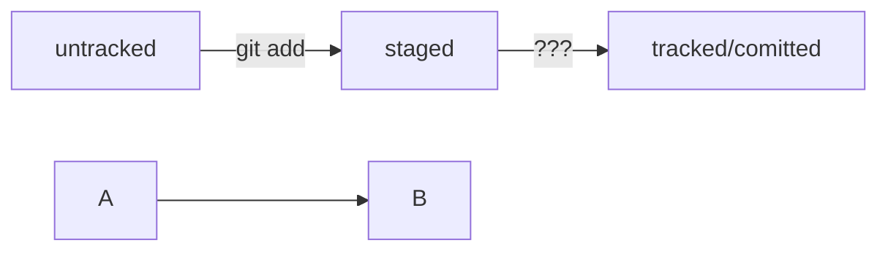

1. **Сделать папку репозиторием** — git init
2. **Сделать папку репозиторием** — git init
3. **Проверить состояние репозитория** — git status
4. **Подготовить файлы к сохранению** — git add
5. **Выполнить коммит** — git commit -m "comment"
6. **Просмотреть историю коммитов** — git log

----

**Инструкция по генерации SSH-ключа** - ssh-keygen -t ed25519 -C "электронная почта, к которой привязан ваш аккаунт на GitHub" 

**скопировать содержимое ключа в буфер обмена:**
$ pbcopy < ~/.ssh/id_rsa.pub

7. **Привязать удалённый репозиторий к локальному** — git remote add

git remote add origin git@github.com:%ИМЯ_АККАУНТА%/first-project.git 

8. **Убедиться, что репозитории связаны** — git remote -v
9. **Отправить изменения на удалённый репозиторий** — git push

git push -u origin main 

Git преобразует информацию о коммитах с помощью алгоритма SHA-1 и для каждого из них рассчитывает уникальный идентификатор — хеш.


Хеш — основной идентификатор коммита и позволяет узнать его автора, дату и содержимое закоммиченных файлов.


Все хеши, а также таблицу соответствий хеш → информация о коммите Git хранит в папке .git.


Можно вызвать не только полный лог, но и сокращённый — это делается командой git log --oneline.
                          
                          
 В сокращённом логе выводятся сокращённые хеши — их можно использовать точно так же, как и полные.
 
 
 В числе прочих файлов в папке .git есть служебный файл HEAD. Он указывает на самый свежий коммит.
 
 
                          
 Вместо хеша последнего коммита можно написать слово HEAD — Git вас поймёт.
 
 - Статусом untracked помечается файл, о существовании которого Git знает, но не следит за изменениями в нём. Этот статус — противоположность tracked, в который попадают все файлы, отслеживаемые Git.
- Файл переходит в статус staged после выполнения git add.
- Статус modified означает, что файл был изменён.
- Большинство файлов в проектах «шагает» по следующему циклу: «изменён» → «добавлен в список на коммит» → «закоммичен» → «изменён» → и так далее.
- Команда git status всегда подскажет, что происходит с файлом: например, он добавлен в список «на коммит» или ещё вообще не отслеживается, или изменён.
- git status показывает явно следующие состояния файлов: untracked, staged и modified.
- git status подсказывает, какие команды можно выполнить, чтобы поменять состояние файла.

HEAD -- это голова.
Коммит -- это всему голова.
Статусы файлов:
<тут пустая строка!>

```mermaid
%% описание схемы
```
<и тут пустая строка!>





